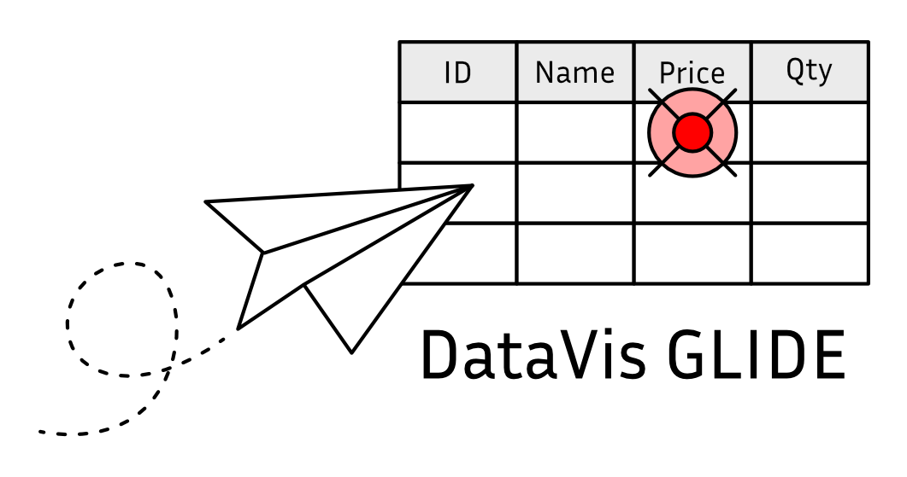

# DataVis GLIDE

DataVis is a system for exploring, manipulating, and visualizing data. It consists of multiple components in multiple layers, each responsible for different elements of a complete system. This layer, DataVis GLIDE, provides user interfaces for exploring data. This includes:

- Complete interactive controls to filter, group, pivot, aggregate, sort, and export data.
- “Grids” to display tabular data, including a “tree mode” details view for grouped data.
- “Graphs” to display aggregate results.
- View saving, column resizing, row selection, floating headers, pagination, and much more.

**GLIDE = Graphical Layer for Interactive Data Exploration**

## How to Use

### Vite

Stick this in your `package.json` obviously.

```
"dependencies": {
  "wcdatavis": "git+ssh://git@github.com:mieweb/wcdatavis.git",
  "vite": "=7.3.1"
}
```

#### Building a Page

Inside a module script tag, import the CSS for DataVis and its dependents. This is necessary when using Vite in this configuration, but not if using a version of DataVis built via Rollup (which uses the PostCSS plugin to automatically extract and bundle all CSS files imported from JS).

```
import 'jquery-ui/dist/themes/base/jquery-ui.min.css';
import 'sumoselect/sumoselect.min.css';
import 'wcdatavis/wcdatavis.css';
```

Then just use DataVis like normal:

```
import { Source, ComputedView, Grid } from 'wcdatavis/index.js';

document.addEventListener('DOMContentLoaded', () => {
  const source = new Source({
    type: 'http',
    url: 'fruit.csv'
  });
  const computedView = new ComputedView(source);
  new Grid({
    id: 'grid',
    computedView: computedView
  }, {
    title: 'DataVis NPM Example (Using Vite)'
  });
});
```

Make sure you also have a div to contain the grid on the page.

```
<div id=”grid”></div>
```

#### Available Exports

| Export         | Description                                                  |
| -------------- | ------------------------------------------------------------ |
| `Source`       | Fetches and decodes data from HTTP, files, or local JavaScript |
| `ComputedView` | Implements filtering, grouping, pivoting, and aggregation    |
| `Grid`         | Renders data in a table with interactive controls            |
| `Graph`        | Renders data as charts using Chart.js                        |
| `Prefs`        | User preferences management                                  |
| `Perspective`  | Save and restore view configurations                         |
| `ParamInput`   | Parameter input handling for sources                         |

### Traditional Website

1. Run `make setup` to get dependencies.
2. Run `make datavis` to build the JS file.
3. Copy `dist/wcdatavis.js` and `dist/wcdatavis.css` to your server.
4. Include them like any other JS and CSS files.

## How to Develop

See the [Development section of the Manual](doc/md/development/index.md) for a full explanation.  What follows is a synopsis.

### Quickstart

We use GNU Make to provide a simple interface to the various tools to build and test DataVis.

* `make setup` — Installs all dependencies.
* `make datavis` — Build the compressed DataVis JS and CSS files.
* `make tests` — Same as `make`, then copy to tests directory, and build test data.
* `make [PORT=] serve` — Start local server for interactive testing.
* `make test` — Same as `make tests`, then run automated tests using Mocha & Selenium.
* `make doc` — Build all documentation.
  * `make jsdoc` — Build JS API documentation from comments in the source.
  * `make manual` — Build the Manual from Markdown files.
* `make clean` — Remove all build products and generated test data.
* `make teardown` — Resets the development environment.

## Tree Structure

* `bin` — Contains programs used to build other stuff, e.g. a JSON generator.
* `dist` — After compiling with `make`, contains the JS and CSS files for DataVis.
* `doc` — The user & developer manual.
  * `md` — Manual Markdown source files.
  * `html` — Manual HTML output files.
* `src` — Contains all the source JS files.
  * `renderers` — Classes for DataVis output.
  * `ui` — Classes for user interface components.
    * `filters` — Filter widget implementation.
    * `windows` — Modal dialogs.
  * `util` — Classes and modules for utilities.
  * `reg` — Registry files.
  * `lang` — Compiled language packs.
* `tests`
  * `data` — Data files for testing and examples.
    * `*.json5` — Input for generating JSON files.
    * `*.in.json` — Input for generating JSON files.
  * `lib` — Auxiliary JS files to help make writing test cases easier.
  * `pages` — HTML pages used for running Selenium tests.
    * `grid` — Tests specifically for the grid.
    * `graph` — Tests specifically for the graph.
    * `qunit` — Unit tests, mostly for the view.
  * `selenium` — Selenium test case files.

## History

The original DataVis project consisted of both the data processing and interactive UI functions. It has now been split into two projects: DataVis ACE (this project) and DataVis GLIDE (an intuitive but complete user interface to explore the data).
