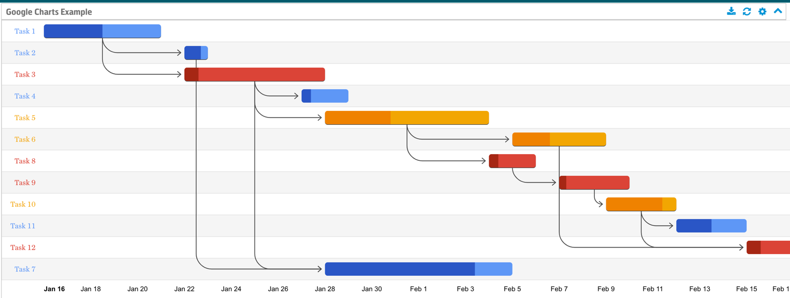
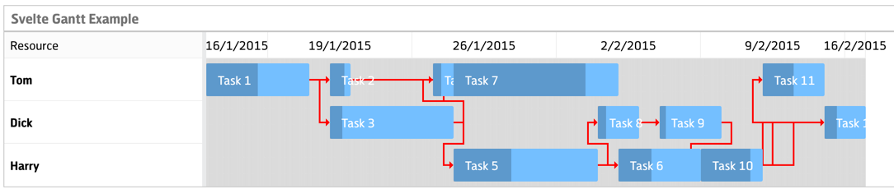

# Gantt Charts

There are two options for renderers that can generate Gantt charts: Google and Svelte-Gantt.

## Google

The Gantt chart provided by Google Charts shows tasks in rows, with colors representing the different resources. Hovering over the blocks shows the name of the resource.

The data must have the following fields:

- `ID` — Task ID. If there is no such field, the row number (starting at 1) will be considered the ID.
- `Task` — Label for the task (required).
- `Resource` — Label for the resource (required).
- `Start` — Task start date.
- `End` — Task end date.
- `Duration` — Task duration.
- `Completion` — Integer specifying the percentage completion, e.g. “50” means half done.
- `Dependencies` — Comma-separated list of IDs of other tasks that are dependencies of this task. When there is no ID field, the row number is used, so a task with dependencies of `1,3` means this task relies on the first and third task being done.

!!! note
	The Google Gantt chart automatically calculates a missing start, end, or duration from the other two fields. DataVis will not check for this condition.

## Svelte-Gantt

The Gantt chart provided by Svelte-Gantt shows a row for each resource, with the tasks for each resource laid out along the timeline in the row. Your real data will probably look better than this randomly generated example.

The data must have the following fields:

- `Task` — Label for the task (required).
- `Resource` — Label for the resource (required).
- `Start` — Task start date (required).
- `End` — Task end date (required).
- `Completion` — Integer specifying the percentage completion, e.g. “50” means half done.
- `Dependencies` — Comma-separated list of row numbers of other tasks that are dependencies of this task. For example: `1,3` means this task relies on the first and third task being done.